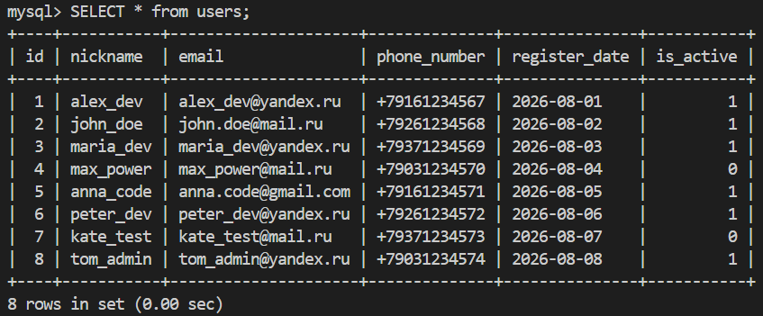

# Задание №1
<b>С чем столкниулся</b><br>
При создании контейнера была указана src директория по умолчанию, при попытке просмотра страницы index.php выходила ошибка 404 - по пути var/www/html/index.php<br><br>
<b>Как решил</b><br>
Чтобы мы смогли увидеть старницу index.php нам нужно указать в docker-compose.yml (поле volumes) ```- ./src/public:/var/www/html``` вместо стандартного ```- ./srс:/var/www/html``` при условии нахождения страницы index.php по пути src/public/index.php.<br>
Более комплексный подход предполагает создание файла dockerfile с измененными параметрами Apache DocumentRoot:<br>
```
FROM php:8.2-apache
ENV APACHE_DOCUMENT_ROOT /var/www/html/public
RUN sed -ri -e 's!/var/www/html!${APACHE_DOCUMENT_ROOT}!g' \
    /etc/apache2/sites-available/*.conf \
    /etc/apache2/apache2.conf \
    /etc/apache2/conf-available/*.conf
```
В таком случае структура приложения внутри контейнера сохраняется ```/var/www/html/public/index.php```, а Apache настраивается таким образом, чтобы использовать ```/var/www/html/public``` в качестве DocumentRoot. 
<br>Это более комплексный и предпочтительный подход для приложений с разделением публичной и внутренней частей, так как директория public становится единственной директорией, доступной через веб-сервер. При этом остальные директории приложения (app, config, storage и т. д.) не должны напрямую раздаваться Apache.

# Задание №2

Разделил запросы на 3 группы (3 файла):
- `init.sql` - создание таблиц
- `seed.sql` - заполнение таблиц данными
- `queries.sql` - запросы к базе данных

Для запуска в docker прописал пути к файлам с таблицами:
```
volumes:
- mysql_data:/var/lib/mysql
- ./database/init.sql:/docker-entrypoint-initdb.d/01-init.sql
- ./database/seed.sql:/docker-entrypoint-initdb.d/02-seed.sql
- ./database/queries.sql:/docker-entrypoint-initdb.d/03-queries.sql
```
Таблицы успешно создаются:
```
docker exec -it mysql_db mysql -uapp -papp app

mysql> SHOW TABLES

+---------------+
| Tables_in_app |
+---------------+
| tasks         |
| users         |
+---------------+
2 rows in set (0.00 sec)
```

Трудностей с заданием не возникло.

